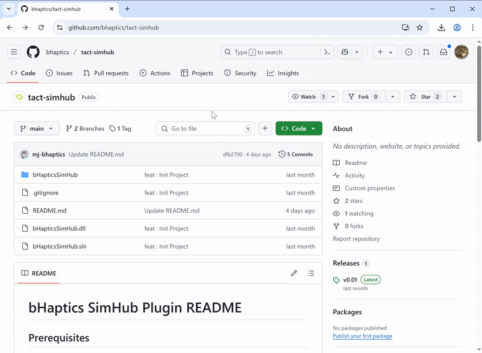
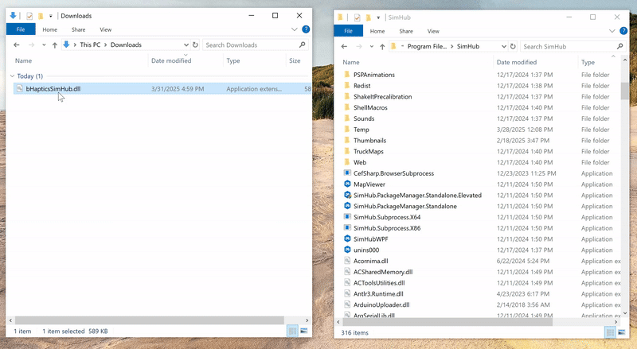
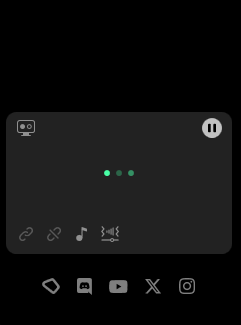
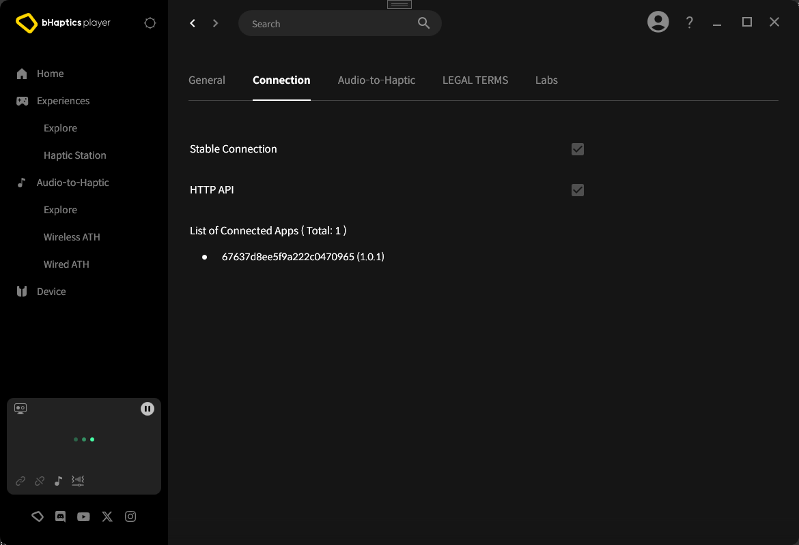
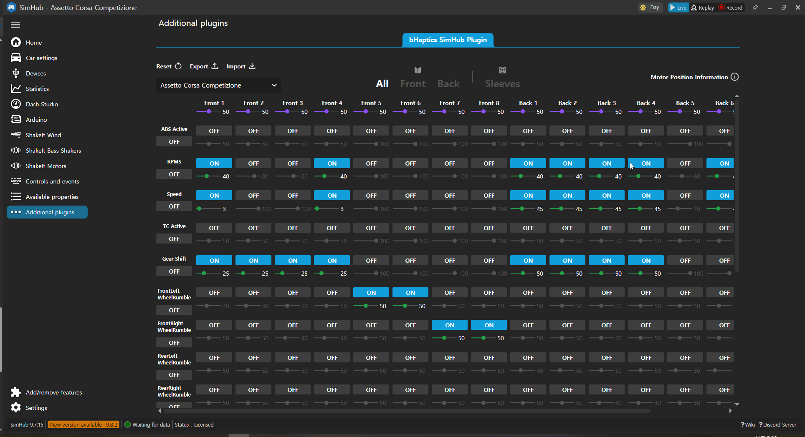
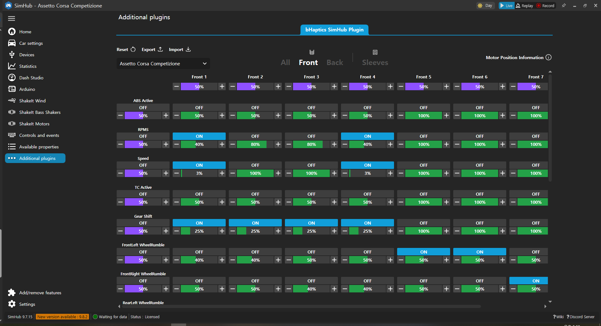
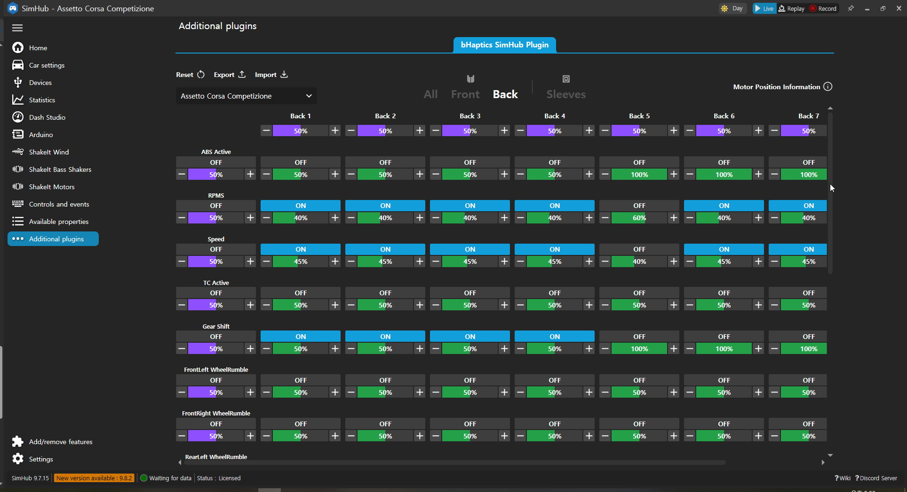
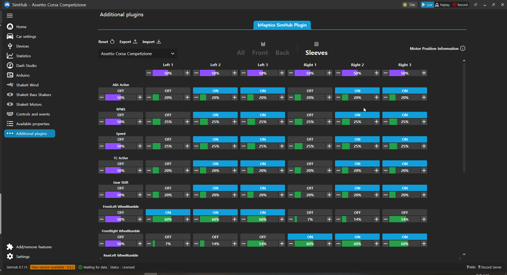

# bHaptics SimHub Plugin
This is a SimHub plugin for [bHaptics devices](https://bhap.it/43z0cOb)

## Prerequisites
* [bHaptics Player](https://bhap.it/42eQG0l) (v2.5.6.72 or higher)
* [SimHub installation](https://www.simhubdash.com/download-2/)

## Installation
### 1. Download [the bHapticsSimHub.dll file](https://github.com/bhaptics/tact-simhub/releases/latest) from releases page

### 2. Paste the DLL into your SimHub installation folder (Default location - C:\Program Files (x86)\SimHub)

### 3. Run SimHub - Check for bHaptics SimHub Plugin in the Additional Plugins section

### 4. Run bHaptics Player - Check if bHaptics SimHub Plugin is connected to bhaptics Player

### 5. check Connection - Check if bHaptics SimHub Plugin is connected to bhaptics Player

## How to use the plugin
1. Run both [bHaptics Player](https://bhap.it/42eQG0l) and [SimHub](https://www.simhubdash.com/) with the bHaptics SimHub plugin
2. Play a sim racing game that supports SimHub

## Screenshots

